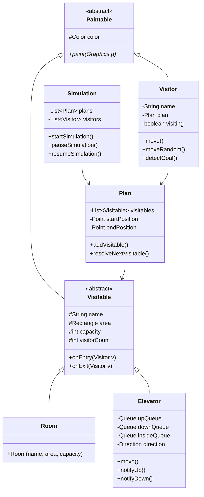
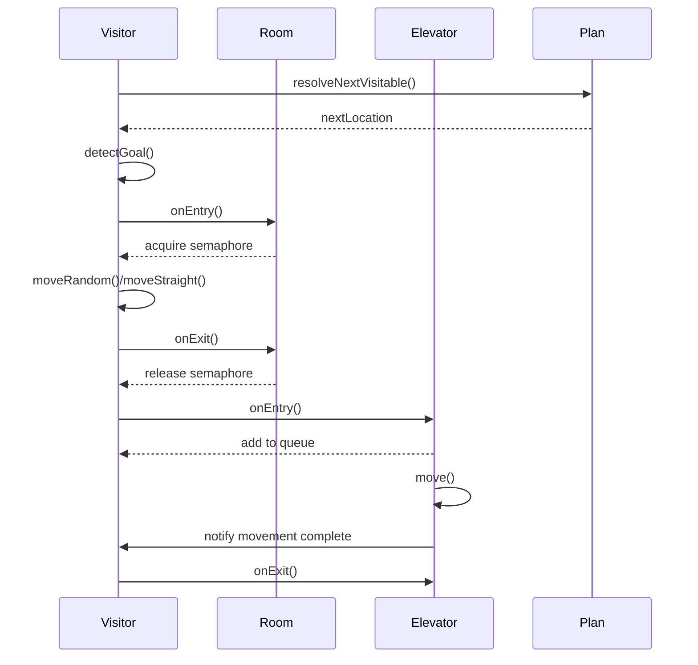
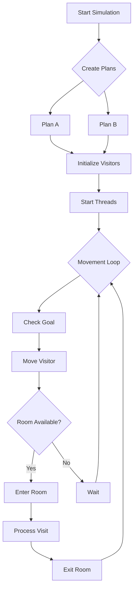

# Mine Simulation Project (Concurrent Programming)

## Overview 🎯
This project simulates a tourist attraction in a salt mine, implementing concurrent programming principles to manage visitor movement and resource allocation. The simulation recreates a real-world scenario where multiple tourists navigate through a complex mine structure with specific constraints and rules.

## Project Structure 🗂️
The project is part of a larger repository containing different laboratory works. The main simulation project is located in the `simulation` folder, while other directories contain labs from different classes.

```
.
├── .idea
├── demo
├── lab_src
│   ├── .idea
│   └── src
│       ├── lab3_4
│       ├── lab5_6
│       ├── lab7_8
│       ├── lab9_10
│       └── simulation
│           ├── Connector.java
│           ├── Controllable.java
│           ├── Elevator.java
│           ├── Paintable.java
│           ├── Plan.java
│           ├── Room.java
│           ├── Simulation.java
│           ├── Visitable.java
│           ├── Visitor.java
│           ├── config.properties
│           ├── .gitignore
│           └── lab3_4.iml
├── .gitignore
├── LICENSE.md
├── README.md
└── lab3_4.iml
```

## Detailed Project Description 📋

### Mine Structure
The mine consists of four main chambers interconnected by passages:
- 3 standard rooms (R1, R3, R4) with capacity X visitors
- 1 larger room (R2) with capacity 2X visitors
- 2 elevators (E1, E2) for vertical transportation
- Single-person bidirectional passages connecting the rooms

## Movement Rules 📋

1. Visitors cannot stop in passages between rooms
2. Passages are bidirectional
3. Passages allow only one person at a time
4. Visitors can pass through rooms without visiting them
5. Rooms cannot be divided into restricted access zones

## Notes 📌

- Each room displays a counter showing the current number of visitors
- Green paths indicate visitor routes
- Visitors can move either randomly (when visiting) or directly (when passing through)
- The Pause button changes to Resume when simulation is paused
- Multiple rapid clicks on the Restart button should be avoided to prevent unstable behavior

### Visiting Plans
The simulation supports two distinct visiting routes:
- **Plan A**: E1 → R1 → R2 → R3 → R4 → E2
- **Plan B**: E2 → R4 → R3 → R2 → R1 → E1

### Technical Implementation
The project utilizes modern Java concurrency features:
- Virtual threads for efficient visitor simulation
- Semaphores for room capacity management
- Synchronized blocks for critical sections
- Blocking queues for elevator management
- Event-driven GUI updates

## Architecture Diagrams 📊

### Class Diagram




### Sequence Diagram
    


### Flowchart



## Key Features 🔑

### Advanced Movement System
- **Intelligent Pathfinding**: Visitors can navigate between rooms using the shortest available path
- **Dynamic Speed Adjustment**: Movement speed adapts based on congestion and room availability
- **Random/Direct Movement**: Visitors can either explore rooms randomly or move directly to exits

### Resource Management
- **Thread-Safe Room Access**: Synchronized access to prevent overcrowding
- **Smart Elevator Scheduling**: Efficient elevator algorithms to minimize wait times
- **Queue Management**: Fair queuing system for rooms and elevators

### Monitoring and Control
- **Real-time Statistics**: Displays current visitor count and room occupancy
- **Visual Feedback**: Color-coded paths and visitor states
- **Interactive Controls**: Dynamic adjustment of simulation parameters

## System Requirements 💻

### Minimum Requirements
- Java 21 or higher (for virtual threads support)
- 4GB RAM
- 1920x1080 display resolution (recommended)

### Development Environment
- IDE: IntelliJ IDEA, Eclipse, or NetBeans
- Build System: Java Build Path
- Required Libraries: Java Swing (included in JDK)

## Performance Considerations ⚡

### Optimization Techniques
1. **Thread Pool Management**
   - Uses virtual threads for efficient concurrency
   - Automatic thread lifecycle management

2. **Resource Utilization**
   - Minimized synchronization overhead
   - Efficient memory usage through object pooling

3. **GUI Performance**
   - Optimized rendering pipeline
   - Double buffering for smooth animations
   
## Project Status ⌛
This project was completed on 06/10/2024 as part of the Concurrent Programming course (PW-12/2024) under the supervision of dr inż. Jarosław Rulka.
